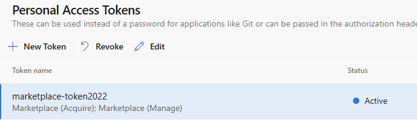

# command

记得需要在 `.vscodeignore` 文件下配置排除当前文件夹. 否则, 打包的时候会将文档也打包进去.

   ```conf
   .doc/**
   .doc
   ```


## 本地打包成 vsix 文件

   ```cmd
   vsce package
   ```

## 发布至应用市场

   ```cmd
   vsce publish
   ```

## 如果 token 失效, 则需要到

https://cpfniliu.visualstudio.com/_usersSettings/tokens 上面创建新的token.

选择 marketplace(acquire, manager) 的权限, 之后使用-p 加生成的token发布插件.

   ```cmd
   vsce publish -p <token>
   ```


